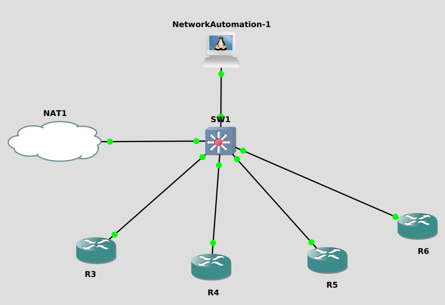

## Ansible Study Notes

This is complementary material for the study notes created in this <a href="www.netwhithalex.blog"> post </a>

### Built With

* [![Ansible][Ansible.io]][Ansible-url]
* [![Jinja][Jinja.io]][Jinja-url]

### Prerequisites

It is recommended to have a virtualized environment to emulate network devices and ansible server node.  

I used [GNS3](https://www.gns3.com/) running on my local machine

From the marketplace you can look for the following appliances and import them to your GNS3 server:
* Cisco IOU L3
* Cisco IOU L2
* Network Automation

### Topology



### Getting started

#### 1. Configure devices and enable SSH access required for Ansible. 
   Inside the _additional materials_ folder you can find the initial running config of the network devices, change it accordingly. You might still need to    generate the ssh key manually with 
   ```sh
   crypto key generate rsa modulus 2048
   ```
   If you shut down the IOU devices, the crypto keys will be erased, you can run the  _generate_ssh_key.yml_  to create it on all devices 
   ```sh
   ansible-playbook generate_ssh_key.yml -i inventory_insecure
   ```
   At any time you can use the _erase_config.yml_ to erase configuration before pushing it again with through a playbook. 

#### 2. Explore _ansible_1_
   * This folder contains a playbook to configure Loopbacks and OSPF process. Notice tasks are repeated multiple times
   * The inventory file contains user and password information
   * The ansible.cfg file is using default information. To run the playbook you need to specify the inventory file (_-i option_).
   ```sh 
   ansible-playbook manual_configuration.yml -i inventory_insecure
   ```
  
#### 3. Explore _ansible_2_
   * This folder contains a playbook to configure Loopbacks and OSPF process using variables. These 2 tasks are enough to configure the 4 devices. 
   * The inventory file is not containing user and password information. Instead, this information is passed on the playbook itself.  
   * The ansible.cfg file was slightly altered to point to the local inventory file. Playbook can be run without _-i option_. 
   ```sh
   ansible-playbook variables_configuration.yml
   ```

#### 4. Explore _ansible_3_
   * This folder contains a playbook to generate router configuration using Jinja templates. 
   * The Jinja templates will look for the values of the variables inside the router_vars.yml file 
   * The playbook contains a task to push the configuration file once it is created
   ```sh
   ansible-playbook create_template_and_push.yml
   ```

<!-- CONTACT -->
## Contact

[![Linkedin][linkedin-shield]][linkedin-url]

![Gmail][gmail-shield] - netwithalex@gmail.com


<!-- MARKDOWN LINKS & IMAGES -->
<!-- https://www.markdownguide.org/basic-syntax/#reference-style-links -->

[Ansible.io]: https://img.shields.io/badge/Ansible-000000?style=for-the-badge&logo=ansible
[Ansible-url]: https://www.ansible.com/
[Jinja.io]: https://img.shields.io/badge/Jinja-B41717?style=for-the-badge&logo=jinja
[Jinja-url]: https://jinja.palletsprojects.com/en/3.1.x/templates/
[linkedin-shield]: https://img.shields.io/badge/Linkedin-0A66C2?style=for-the-badge&logo=linkedin
[linkedin-url]: https://www.linkedin.com/in/alejandro-ruiz-s-6080a413b
[gmail-shield]: https://img.shields.io/badge/Gmail-FFFFFF?style=for-the-badge&logo=Gmail
[gmail-url]: netwithalex@gmail.com
